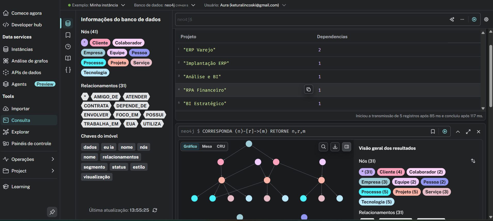

# Análise de Grafos L7 | L7 Graph Analytics

Este projeto é uma prova de conceito de análise de grafos desenvolvida usando o Neo4j Aura F para apoiar a inteligência de negócios e a tomada de decisões estratégicas na L7 Tech.

## Visão geral do projeto
O modelo gráfico representa:
- Clientes
- Projetos
- Processos
- Órgãos transversais
- Colaboradores

## Visualização do Grafo
A seguir está a representação visual dos dados no Neo4j Aura:

## Impacto para o Negócio
Este modelo permite:
- Identificar projetos críticos com alto grau de dependência
- Detectar gargalos operacionais entre áreas e processos
- Apoiar decisões estratégicas sobre priorização de iniciativas
- Mapear riscos de dependência tecnológica
- Melhorar a comunicação entre áreas técnicas e executivas

## Análise de Dependências dos Projetos

Abaixo está a tabela de criticidade baseada em dependências:

## Como Executar o Projeto
1. Abra o Neo4j Aura gratuitamente
2. Abra o navegador Neo4j
3. Execute os arquivos Cypher nesta ordem:
   - 01_create_nodes.cypher
   - 02_create_relationships.cypher
   - 03_dashboard_queries.cypher

## Tecnologias Utilizadas
- Neo4j Aura (Free)
- Linguagem de consulta Cypher
- Modelagem de dados em grafos
- Análise de grafos
- Business Intelligence

## Sobre o Projeto
Este projeto faz parte do meu portfólio profissional e demonstra minha capacidade de estruturar, analisar e extrair insights estratégicos a partir de dados complexos utilizando grafos.

